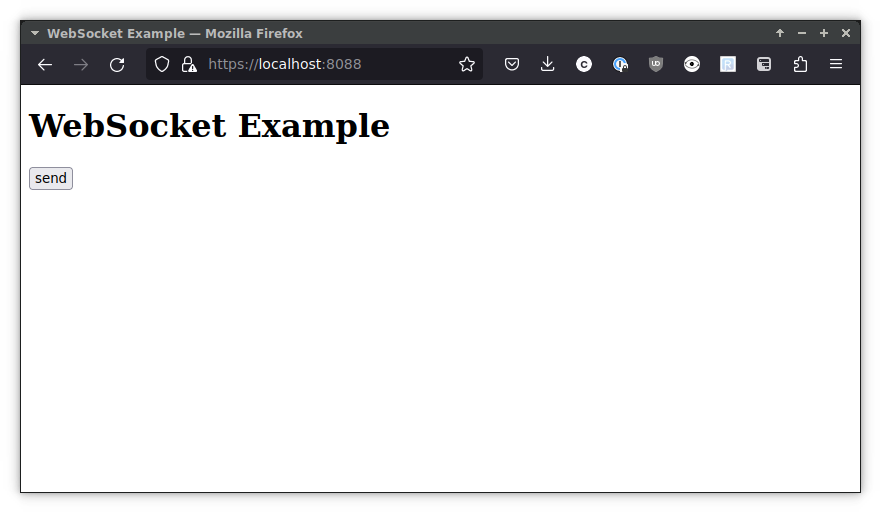
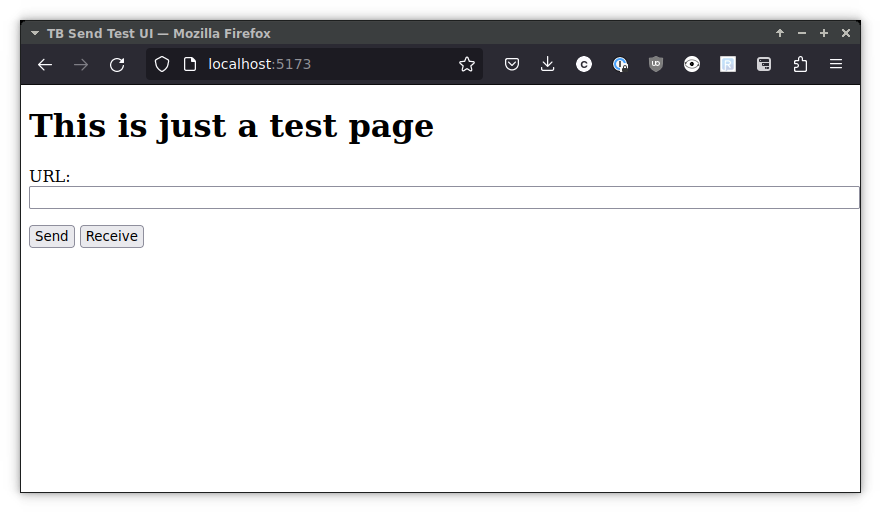
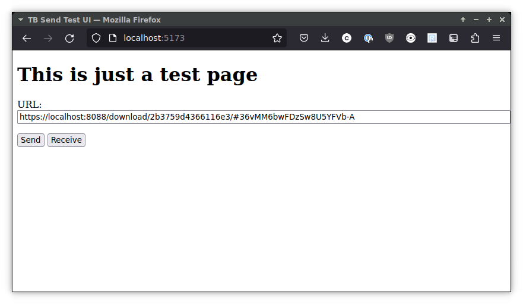
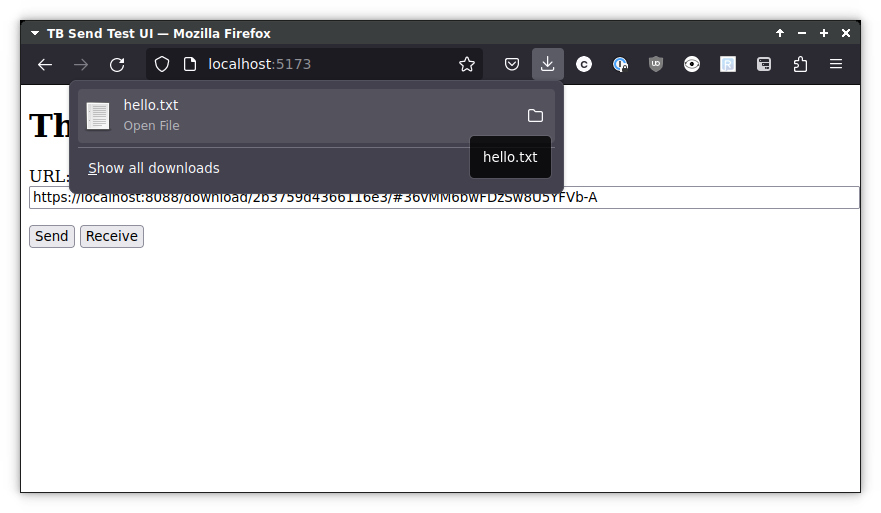
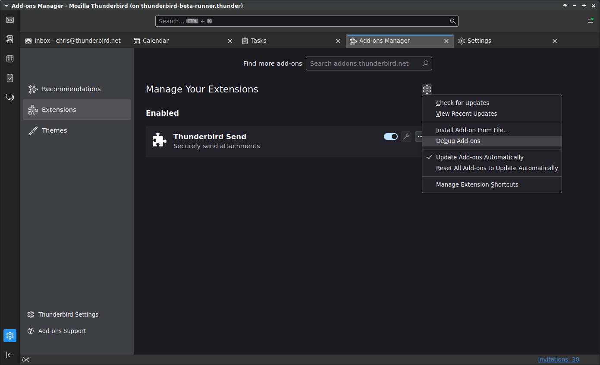
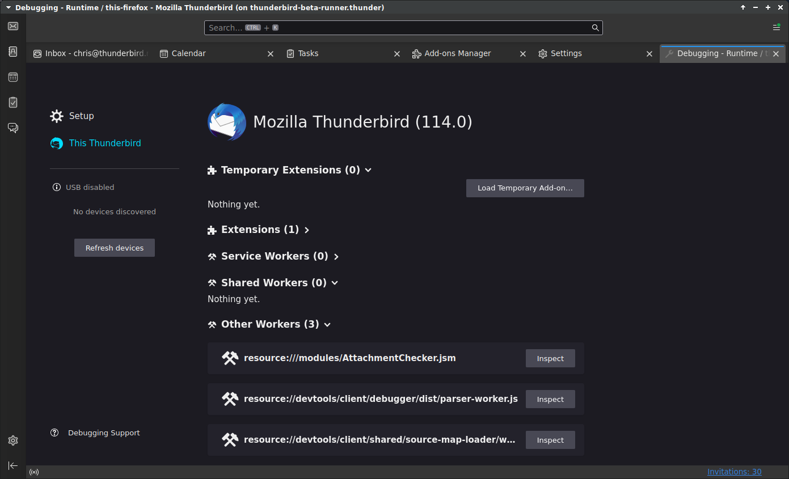
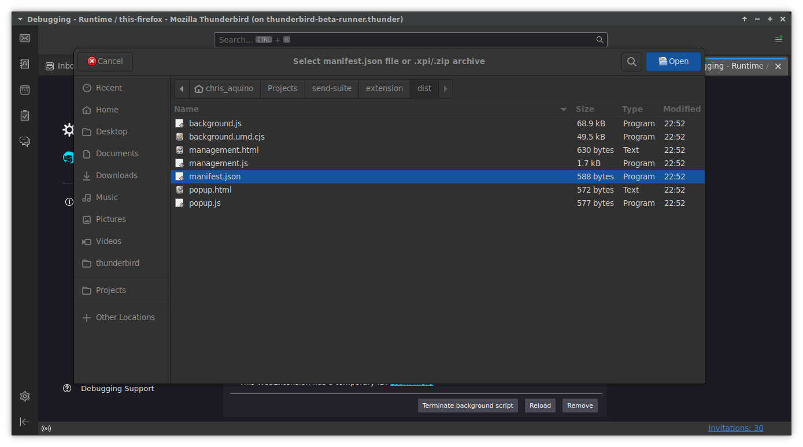
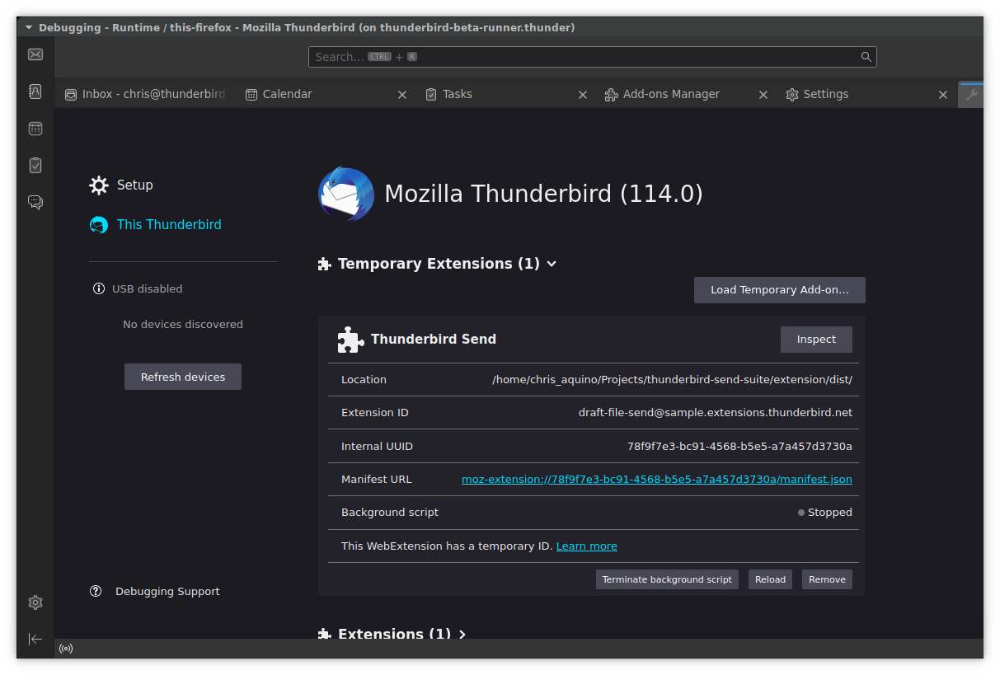
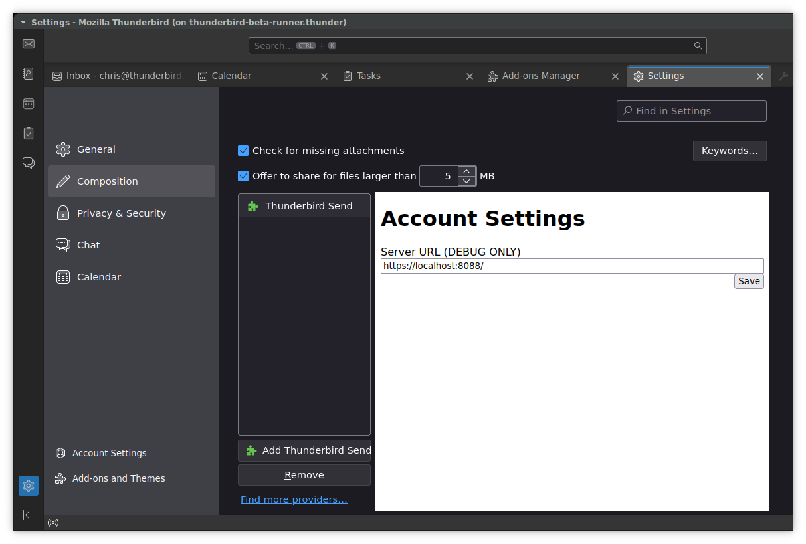
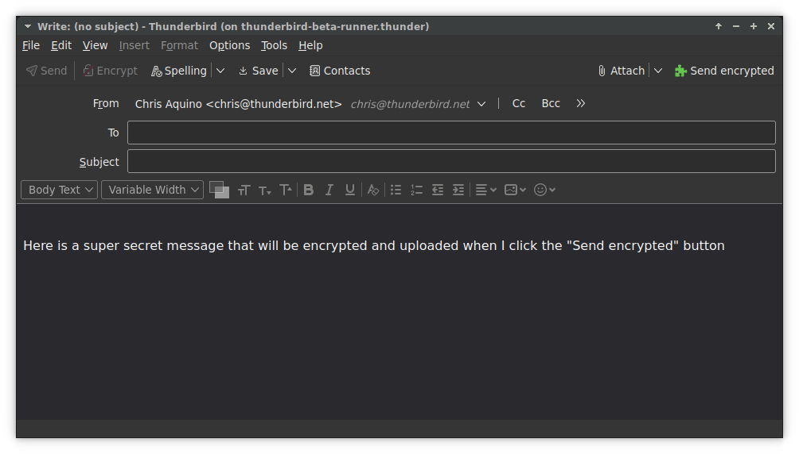

# Work in Progress: Thunderbird Send Suite

Provides (or will provide) the following features for Thunderbird:

- Send: encrypts and uploads file attachments, inserting a download link in the email body
- Messages: less secure than using OpenPGP, provides easier-to-use encrypted messaging
- Lockbox: encrypted file storage and sharing

There are three directories in this project:

- `service/` contains the backend and is based on [timvisee/send](https://gitlab.com/timvisee/send) (which is a fork of [mozilla/send](https://github.com/mozilla/send))
- `extension/` is a vite project that builds the extension and includes an HTML page for testing communication with the backend service
- `tls-dev-proxy/` is a container-ized nginx with a self-signed cert. It is so that the extension can make `wss://` connections to the backend while doing local dev.

## Tooling

- Node.js (v20 was used for development, but an earlier LTS should work)
- `npm` or `pnpm` (examples will use `pnpm`, but `npm` should be fine)
- `docker-compose` or `podman-compose`

## Running the backend service

_Note: these instructions need a sanity-check._

If you've just cloned, you'll need to install the deps and create the dev database:

```
cd service/
pnpm install
npx prisma generate
pnpm run db:migrate
```

After that, you can run the server with `pnpm run dev`

Leave this terminal open so you can see that things are ✨ happening ✨ while you test the front-end.

## Running the TLS server

You'll want to make sure this is running

```sh
cd tls-dev-proxy
docker-compose up -d
```

☝ If you forget this step, you won't be able to upload files/messages to the backend. 🤷

If you visit https://localhost:8088, you should see a page that looks like this:



(Clicking the `send` button currently returns an error, but that definitely means it's running.)

## Confirming communication with the backend

To properly check if you can talk to the backend:

```
cd extension
pnpm run dev
```

This starts a vite dev server. In your browser, go to http://localhost:5173.



Click the `Send` button. You should see a flurry of activity in the terminal where the service is running. Then, you'll see that the URL input is populated.



Then click the `Receive` button. There should be another flurry of activity and your browser should download a `hello.txt` file:



If you view the contents of that file, you'll see something like:

```txt
1684968470416 hello world, how are you?
lorem ipsum.
```

## Building and installing the extension

While in the `extension` directory, run `pnpm run build`.

This will create/update the `dist/` directory.

In Thunderbird, go to `Settings > Add-ons and Themes`

Click the gear icon and choose `Debug Add-ons`


You should now see the `Debugging` tab, with `Temporary Extensions` just below the (old) TB logo


Click the `Load Temporary Add-on` button and choose the `send-suite/extension/dist/manifest.json` file



After choosing the `manifest.json`, you should see that the extension is loaded:



## Configure the extension

To try the Send feature for encrypted attachments, go to `Settings > Composition`



Click `Add Thunderbird Send` so that you can view/edit the "Account Settings"

As of 2023-05-24, we're ignoring the value in `Server URL (DEBUG ONLY)`, but you should fill it out so that TB knows that the extension is ready for use. (Feel free to put `https://localhost:8088` in the input.)

After putting a value in for the `Server URL`, be sure to click `Save`.

## Try it out! (sort of)

### Send encrypted

In a new message composition window, you should see a `Send encrypted` button next to `Attach`:


Type something into the body of the email and then click `Send encrypted` - your `service` terminal should show a lot of activity.

(Coming soon: receiving an encrypted message)
